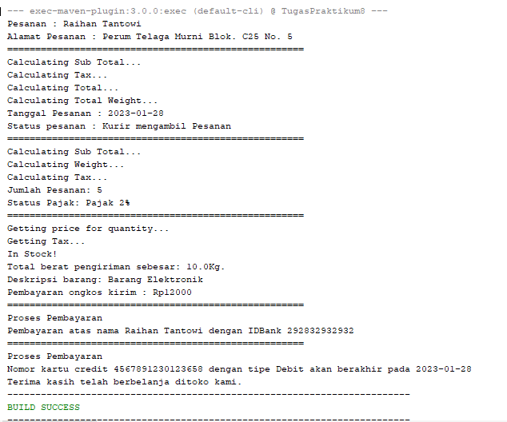

# Tugas Praktikum 8
## Pemrograman Orientasi Objek

```sh
Nama   : Raihan Tantowi
Nim    : 312110229
Matkul : Pemrograman Orientasi Objek
```

#### 1. File Customer.java
* **Langkah awal membuat class customer**
```java
package com.mycompany.tugaspraktikum8;


import java.util.ArrayList;
import java.util.List;

public class Customer {
    private String name;
    private String address;
    private final List<Order> orderList = new ArrayList<Order>();


    public void setName(String name) {
        this.name = name;
    }

    public String getName() {
        return name;
    }

    public void setAddress(String address) {
        this.address = address;
    }
    public String getAddress() {
        return address;
    }

    public void addOrder(Order order) {
        this.orderList.add(order);
    }

}
```

#### 2. File Order.java
* **Selanjutnya membuat class order**
```java
package com.mycompany.tugaspraktikum7;

public class Dosen {
    private String nama;
    private Gender gender;
    private String mengajar;

    public void infoDosen(){
        System.out.println("\nData Dosen :");
        System.out.println("NAMA \t\t\t:" +nama);
        System.out.println("JENIS KELAMIN\t\t:"+getGender().getJenisKelamin());
        System.out.println("MENGAJAR \t\t:" +getMengajar());


    }
    //Method SETTER GETTER
    public Gender getGender() {
        return gender;
    }
    public String getMengajar() {
        return mengajar;
    }

    //Constructor class Dosen
    public Dosen(String nama, String mengajar,Gender jenis){
        this.nama = nama;
        this.mengajar = mengajar;
        this.gender =jenis;
    }
}
```

#### 3. File OrderDetail.java
* **Selanjutnya membuat class OrderDetail**
```java
package com.mycompany.tugaspraktikum8;

public class OrderDetail {
    private int quantity;
    private String taxStatus;
    private Order order;
    private Item item;

    public OrderDetail(Order order) {
        this.order = order;
        this.item = new Item();
    }

    public int getQuantity() {
        return quantity;
    }

    public void setQuantity(int quantity) {
        this.quantity = quantity;
    }

    public String getTaxStatus() {
        return taxStatus;
    }

    public void setTaxStatus(String taxStatus) {
        this.taxStatus = taxStatus;
    }

    public void calcSubTotal() {
        System.out.println("Calculating Sub Total...");
    }

    public void calcWeight() {
        System.out.println("Calculating Weight...");
    }

    public void calcTax() {
        System.out.println("Calculating Tax...");
    }
}
```

#### 4. File Item.java
* **Selanjutnya membuat class Item**
```java
package com.mycompany.tugaspraktikum8;

import java.util.ArrayList;
import java.util.List;

public class Item {
    private double shippingWeight;
    private String description;
    private List<OrderDetail> orderDetailList = new ArrayList<OrderDetail>();

    public double getShippingWeight() {
        return shippingWeight;
    }

    public void setShippingWeight(double shippingWeight) {
        this.shippingWeight = shippingWeight;
    }

    public String getDescription() {
        return description;
    }

    public void setDescription(String description) {
        this.description = description;
    }

    public void addOrderDetail(OrderDetail orderDetail) {
        this.orderDetailList.add(orderDetail);
    }

    public void getPriceForQuantity() {
        System.out.println("Getting price for quantity...");
    }

    public void getTax() {
        System.out.println("Getting Tax...");
    }

    public void inStock() {
        System.out.println("In Stock!");
    }
}
```

#### 5. File Payment.java
* **Selanjutnya membuat class Payment**
```java
package com.mycompany.tugaspraktikum8;


public abstract class Payment {
    private float amount;
    private final Order order;

    public Payment() {
        order = new Order();
    }
}
```

#### 6. File Cash.java
* **Selanjutnya membuat class Cash**
```java
package com.mycompany.tugaspraktikum8;


public class Cash extends Payment {
    private float cashTendered;

    public float getCashTendered() {
        return cashTendered;
    }

    public void setCashTendered(float cashTendered) {
        this.cashTendered = cashTendered;
    }
}
```

#### 7. File Check.java
* **Selanjutnya membuat class Check**
```java
package com.mycompany.tugaspraktikum8;


public class Cash extends Payment {
    private float cashTendered;

    public float getCashTendered() {
        return cashTendered;
    }

    public void setCashTendered(float cashTendered) {
        this.cashTendered = cashTendered;
    }
}
```

#### 8. File Credit.java
* **Selanjutnya membuat class Credit**
```java
/*
 * To change this license header, choose License Headers in Project Properties.
 * To change this template file, choose Tools | Templates
 * and open the template in the editor.
 */
package com.mycompany.tugaspraktikum8;


import java.time.LocalDate;

public class Credit extends Payment {
    private String number;
    private String type;
    private LocalDate expDate;

    public void authorized() {
        System.out.println("Proses Pembayaran");
    }

    public String getNumber() {
        return number;
    }

    public void setNumber(String number) {
        this.number = number;
    }

    public String getType() {
        return type;
    }

    public void setType(String type) {
        this.type = type;
    }

    public LocalDate getExpDate() {
        return expDate;
    }

    public void setExpDate(LocalDate expDate) {
        this.expDate = expDate;
    }
}
```

#### 9. File Main.java
* **Langkah terakhir membuat class main (Method main)**
```java
/*
 * To change this license header, choose License Headers in Project Properties.
 * To change this template file, choose Tools | Templates
 * and open the template in the editor.
 */
package com.mycompany.tugaspraktikum8;

import java.time.LocalDate;

public class Main {
    public static void main(String[] args) {


        Customer imam = new Customer();
        imam.setName("Raihan Tantowi");
        imam.setAddress("Perum Telaga Murni Blok. C25 No. 5");
        System.out.println("Pesanan : " + imam.getName() );
        System.out.println("Alamat Pesanan : " + imam.getAddress());

        System.out.println("=====================================================");

        Order gofood = new Order();
        imam.addOrder(gofood);
        gofood.calcSubTotal();
        gofood.calcTax();
        gofood.calcTotal();
        gofood.calcTotalWeight();
        gofood.setDate(LocalDate.now());
        gofood.setStatus("Kurir mengambil Pesanan");
        System.out.println("Tanggal Pesanan : " + gofood.getDate());
        System.out.println("Status pesanan : " + gofood.getStatus());

        System.out.println("=====================================================");

        OrderDetail detailOrderGoFood = new OrderDetail(gofood);
        detailOrderGoFood.calcSubTotal();
        detailOrderGoFood.calcWeight();
        detailOrderGoFood.calcTax();
        detailOrderGoFood.setQuantity(5);
        detailOrderGoFood.setTaxStatus("Pajak 2%");
        gofood.addOrderDetail(detailOrderGoFood);
        System.out.println("Jumlah Pesanan: " + detailOrderGoFood.getQuantity());
        System.out.println("Status Pajak: " + detailOrderGoFood.getTaxStatus());

        System.out.println("=====================================================");

        Item item = new Item();
        item.getPriceForQuantity();
        item.getTax();
        item.inStock();
        item.setShippingWeight(10.0);
        item.setDescription("Barang Elektronik");
        item.addOrderDetail(detailOrderGoFood);
        System.out.println("Total berat pengiriman sebesar: " + item.getShippingWeight() + "Kg.");
        System.out.println("Deskripsi barang: " + item.getDescription());

        Cash cash = new Cash();
        cash.setCashTendered((float) 12000.0);
        gofood.addCashList(cash);
        System.out.println("Pembayaran ongkos kirim : Rp" + (int) cash.getCashTendered());

        System.out.println("=====================================================");

        Check check = new Check();
        check.setName("Raihan Tantowi");
        check.setBankID("292832932932");
        check.authorized();
        gofood.addCheckList(check);
        System.out.println("Pembayaran atas nama " + check.getName() + " dengan IDBank " + check.getBankID());

        System.out.println("=====================================================");

        Credit credit = new Credit();
        credit.authorized();
        credit.setNumber("4567891230123658");
        credit.setType("Debit");
        credit.setExpDate(LocalDate.now());
        gofood.addCreditList(credit);
        System.out.println("Nomor kartu credit " + credit.getNumber() + " dengan tipe " + credit.getType() + " akan berakhir pada " + credit.getExpDate());

        System.out.println("Terima kasih telah berbelanja ditoko kami.");
    }
}
```

* **Berikut adalah hasil output program:**

